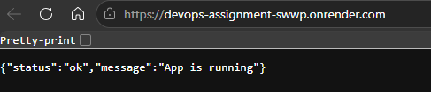
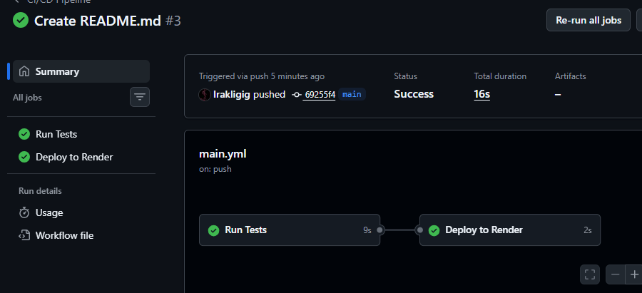
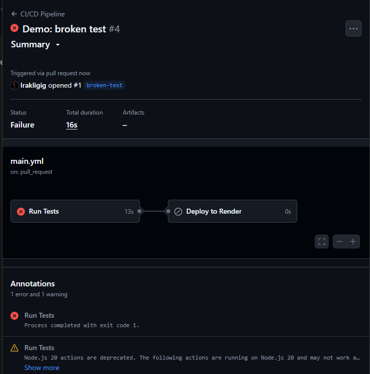

# DevOps Assignment

## Live Application
🔗 https://devops-assignment.onrender.com

## Screenshots

### Live application

### Successful CI/CD run

### Failed pipeline (broken code blocked)

## Pipeline Description
Every push to `main` triggers GitHub Actions which installs Node.js dependencies and runs the Jest test suite. If any test fails, the pipeline stops immediately and deployment is blocked. If all tests pass, a deploy hook is called which triggers Render to pull the latest code and restart the server automatically — no manual intervention required.

## Update Strategy — Rolling Update
Render uses a Rolling Update strategy by default. When a new deploy is triggered:
1. Render builds the new container
2. It runs a health check against the `/health` endpoint
3. Only if the health check passes does it replace the old container
4. If the health check fails, Render aborts and the old version stays live

This means zero downtime on successful deploys and automatic protection against broken releases.

## Rollback Guide
If a bug is discovered in production:

1. Go to [Render dashboard](https://dashboard.render.com)
2. Click your service → **Events** tab
3. Find the last successful deploy
4. Click **Rollback to this deploy**
5. Render immediately redeploys that version with no downtime
